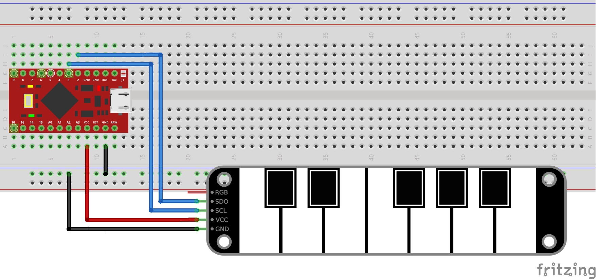
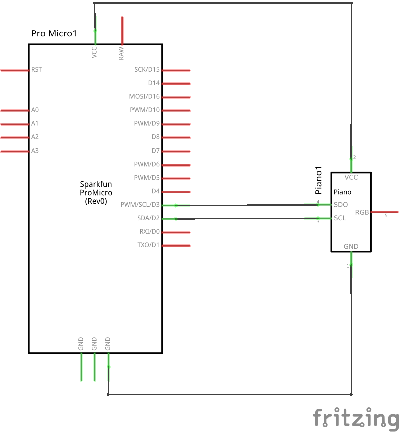

# Arduino ATmega32u4 + Touchpad piano

Using a [Touchpad Piano](https://fr.aliexpress.com/item/1005002898325253.html) with Arduino ProMicro

## Breadboard


## Schematics


## Flash Arduino ProMicro
### Arduino IDE
* Open touchpad-piano/touchpad-piano.ino
* Sketch menu
  * Card type: `Arduino Micro`
  * Port: `/dev/ttyACM0`
  * Upload

### Command line (Ubuntu/Debian)
```shell
sudo apt install arduino-mk
cd touchpad-piano
make
make upload
```

